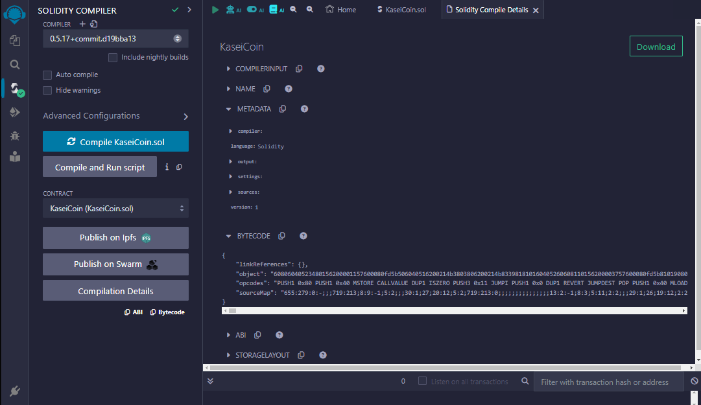
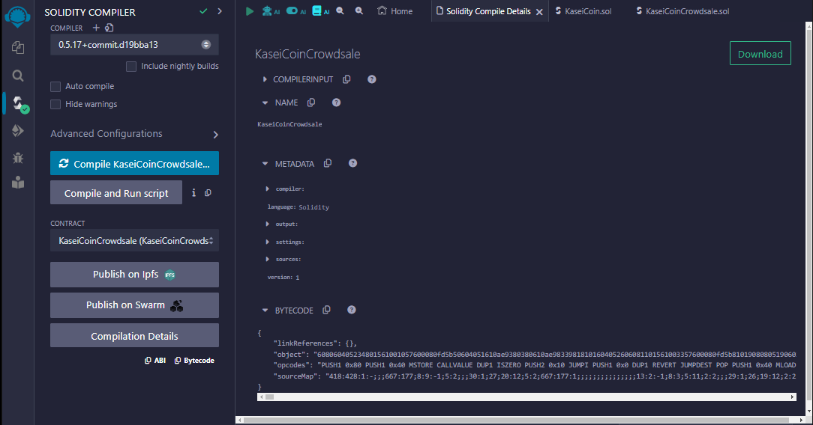
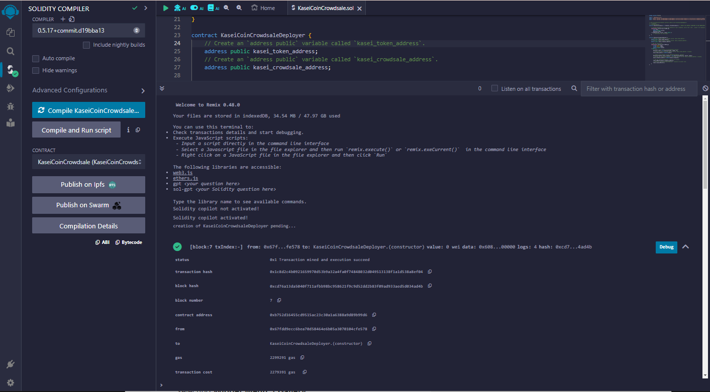
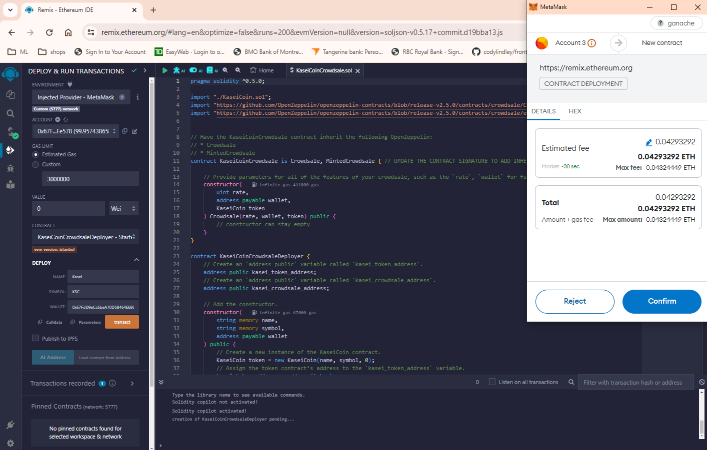
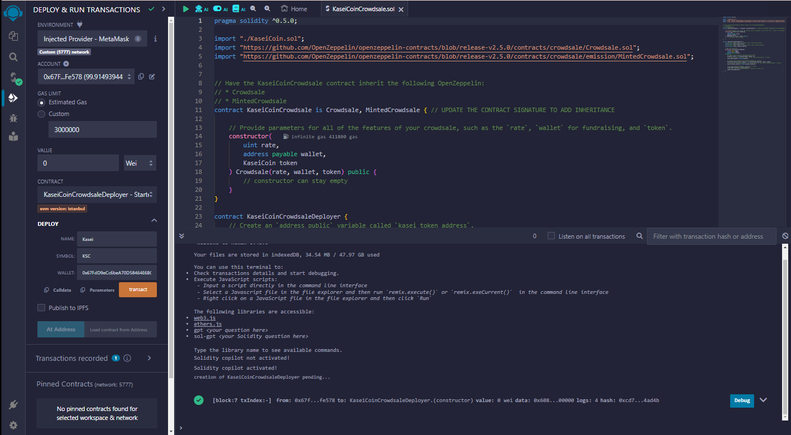
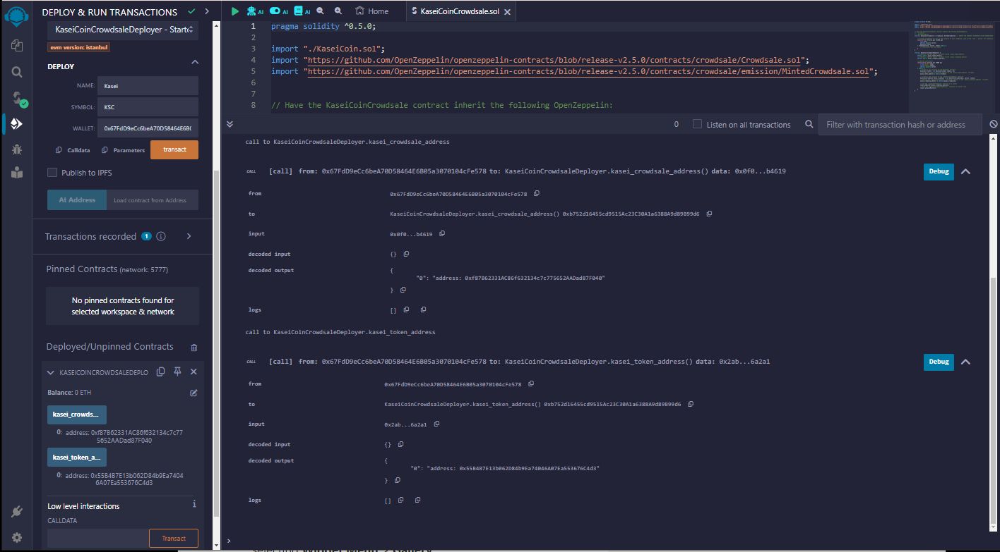
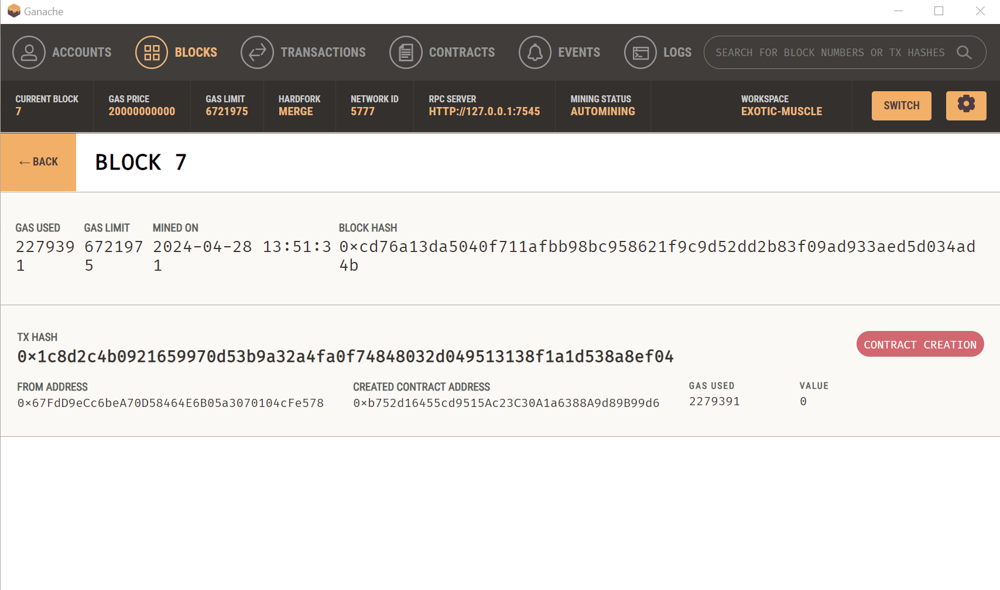
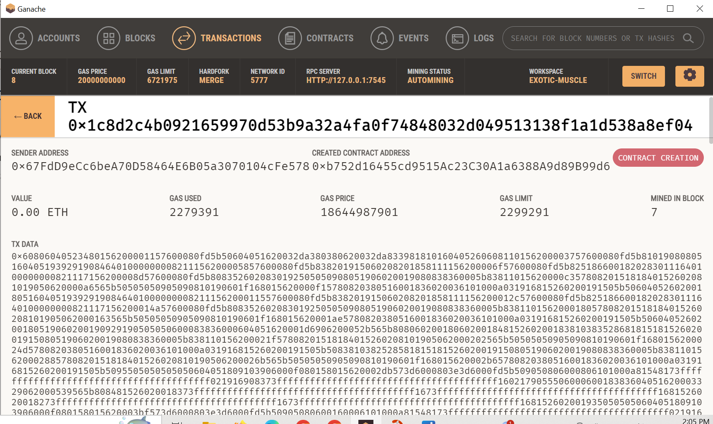
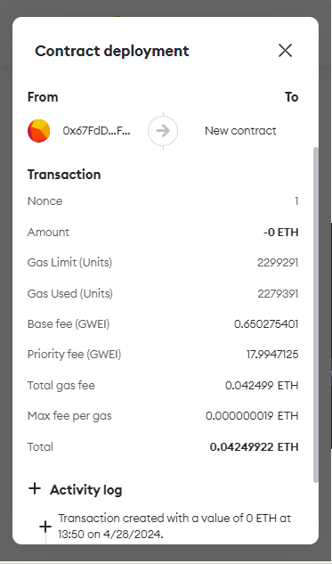

# Unit 21: Martian Token Crowdsale

## Background

After waiting for years and passing several tests, the Martian Aerospace Agency selected you to become part of the first human colony on Mars. As a prominent fintech professional, they chose you to lead a project developing a monetary system for the new Mars colony. You decided to base this new system on blockchain technology and to define a new cryptocurrency named **KaseiCoin**. (Kasei means Mars in Japanese.)

KaseiCoin will be a fungible token that’s ERC-20 compliant. You’ll launch a crowdsale that will allow people who are moving to Mars to convert their earthling money to KaseiCoin.

## Evaluation Evidence

This assignment are divided into the following subsections:

1. Create the KaseiCoin Token Contract

2. Create the KaseiCoin Crowdsale Contract

3. Create the KaseiCoin Deployer Contract

4. Deploy and Test the Crowdsale on a Local Blockchain

5. Optional: Extend the Crowdsale Contract by Using OpenZeppelin

    > **Note:** You can choose whether to complete the optional section. It’s designed to further your professional growth and development but won’t be graded as part of this assignment. If you choose to complete this section, you’ll use OpenZeppelin to extend the functionality of your crowdsale contract by adding time restrictions, refund capabilities, and a cap for the number of tokens that can be created. If you have any questions about how to complete the optional section, please reach out to your instructional team.

